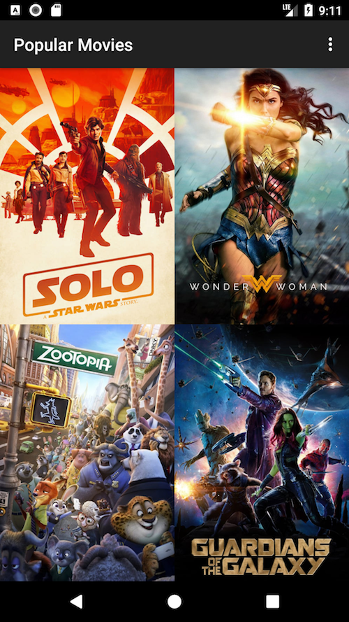
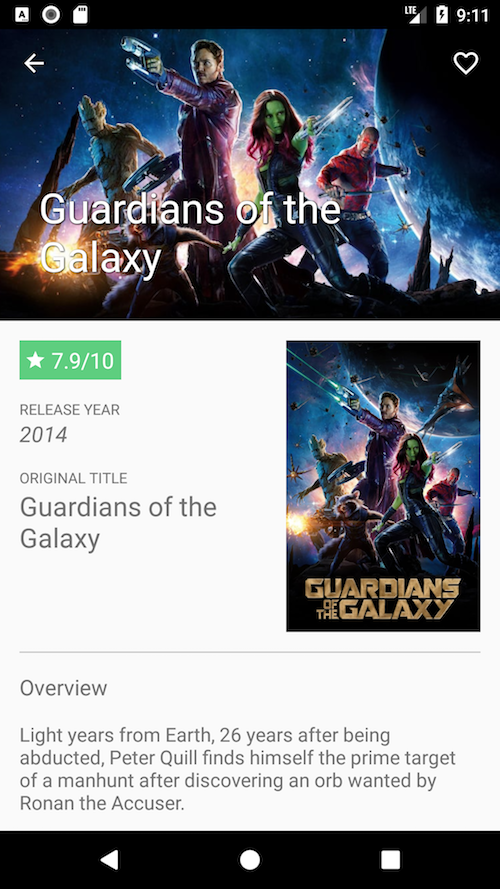
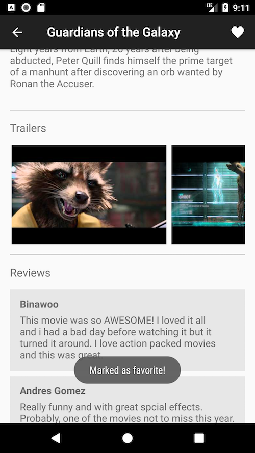
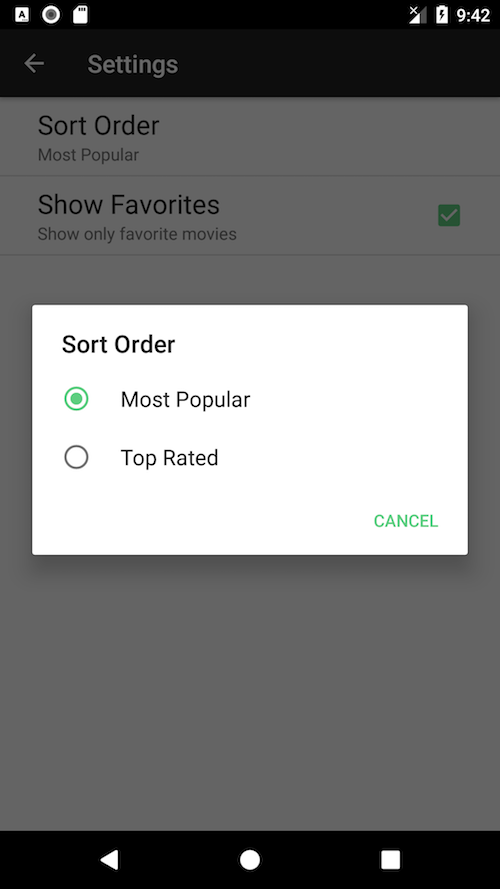

# Popular Movies, Stage 2
A part of the Android Developer Nanodegree Program

*[Stage 1](https://github.com/meekmika/popular-movies-stage-1)*

## Usage
To run the app, a personal API key from [themoviedb.org](https://www.themoviedb.org/) is required. [Create an account](https://www.themoviedb.org/account/signup) and request an API key. Once generated, create a new file in the app module called `keys.properties` and insert the API key.

**app/keys.properties**
```
theMovieDbApiKey = your_api_key
```
## Features
*Implemented in [Stage 1](https://github.com/meekmika/popular-movies-stage-1)*
- Upon launch, present the user with an grid arrangement of movie posters.
- Allow your user to change sort order via a setting:
  - The sort order can be by most popular, or by top rated
- Allow the user to tap on a movie poster and transition to a details screen with additional information such as:
  - original title
  - movie poster image thumbnail
  - A plot synopsis (called overview in the api)
  - user rating (called vote_average in the api)
  - release date

*Implemented in **Stage 2***
- Allow users to view and play trailers (either in the youtube app or a web browser).
- Allow users to read reviews of a selected movie.
- Allow users to mark a movie as a favorite in the details view by tapping a button. (This is for a *local* movies collection that doesn't require an API request).
- Allow users to show their favorites collection.

## Screens
<div float="left">
  
  
  
  
</div>

## Libs
- [Retrofit 2](http://square.github.io/retrofit/) *- HTTP client*
- [Butter Knife](http://jakewharton.github.io/butterknife/) *- Field and method binding for Android views*
- [Picasso](http://square.github.io/picasso/) *-  Image downloading and caching*
